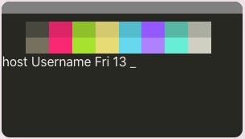
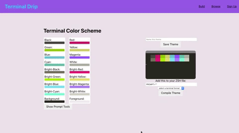
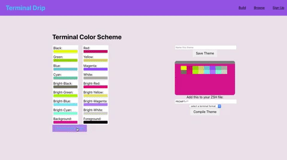
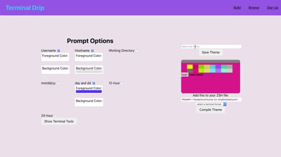

# Terminal Drip
### Intuitive web app that allows the user to quickly and easily create a custom terminal color scheme and zsh prompt

## Usage 
||
| --- |
| **Design your terminal's color scheme** |

||
| --- |
| **Create a ZSH Prompt** |

||
| --- |
| **Download your theme** |

Create an account to save your theme!
